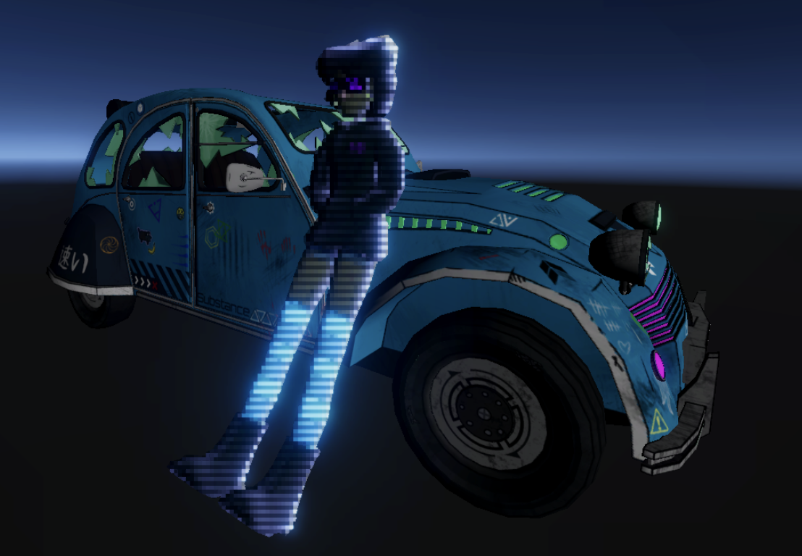

# 3D Stylization – *Animal Well* Inspired Scene

## Overview

This project explores stylized non-photorealistic rendering (NPR) techniques in Unity URP, inspired by the atmospheric and enigmatic look of *Animal Well*. The goal was to recreate the moody, shadow-driven, yet playful style of 2D concept art in a fully 3D interactive environment.

## Demo

<table>
  <tr>
    <th style="text-align:center">Concept-Inspired Stylization</th>
    <th style="text-align:center">In-Game Scene Example 1</th>
    <th style="text-align:center">In-Game Scene Example 2</th>
  </tr>
  <tr>
    <td align="center"></td>
    <td align="center"></td>
    <td align="center"></td>
  </tr>
</table>
 

  

## Features

### Custom Stylized Shaders
- **Toon Shading with Light Bands**  
  Implemented a 3-tone cel shader with smooth lighting transitions, supporting multiple dynamic light sources.
- **Rim & Specular Highlights**  
  Adds visual depth and subtle glows to emulate ambient rim lighting.
- **Custom Shadow Mapping**  
  Used seamless, hand-drawn shadow textures mapped in UV space to create soft, painterly shading effects.

### Outline Rendering (Post-Processing)
- Depth and normal-based Sobel/Roberts edge detection using URP Render Features.
- Stylized with animated line wobble and sketch-like distortion to evoke a hand-drawn look.

### Full-Screen Effects
- Screen-space vignette with chromatic blending and noise overlays.
- Custom palette shifting and tone mapping 

## Inspirations
- *Animal Well* – for its glowing minimalism, eerie calm, and color-restrained lighting.
- Hand-drawn 2D concept art featuring strong outlines and low-saturation palettes.

## Techniques Used
- Unity URP Custom Render Features
- Shader Graph: time-based animation, procedural distortion, UV-based texture mapping
- Post-processing with separate Depth and Normal buffers
- C# scripting for runtime interactivity and material control